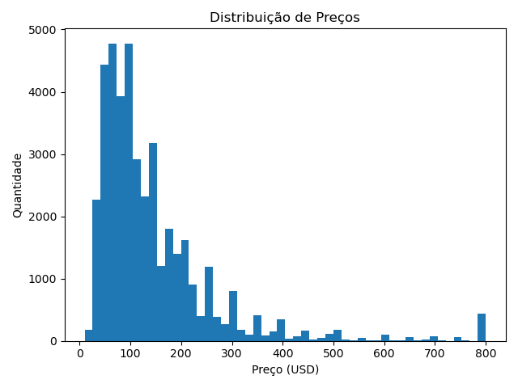
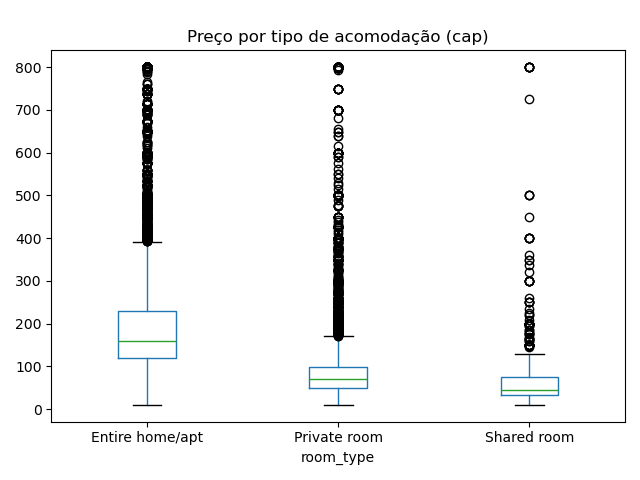

# 🏙️ EDA – Airbnb NYC

# Análise Exploratória do Airbnb em NYC

## 🎯 Objetivo
Este projeto realiza uma Análise Exploratória de Dados (EDA) sobre anúncios do **Airbnb em Nova York (2019)**, com foco em entender os fatores que influenciam os preços dos imóveis, padrões de distribuição e insights relevantes para o mercado de hospedagem.

---

## 🗂 Estrutura do Projeto
- `data/` → contém o dataset bruto utilizado na análise.  
- `notebooks/` → Jupyter Notebooks com o passo a passo da análise.  
- `images/` → gráficos e visualizações gerados na EDA.  
- `requirements.txt` → bibliotecas necessárias para execução.  

---

## 🛠 Ferramentas Utilizadas
- Python  
- Pandas  
- Matplotlib  
- Seaborn  
- Jupyter Notebook  

---

## 🔎 Etapas da Análise
1. **Carregamento e inspeção inicial do dataset**  
2. **Tratamento de valores ausentes e outliers**  
3. **Distribuição de preços e cap no percentil 99**  
4. **Análise comparativa por região (borough)**  
5. **Análise comparativa por tipo de acomodação**  
6. **Visualizações (histogramas, boxplots, etc.)**  
7. **Insights finais**

---

## 📊 Exemplos de Visualizações

Distribuição de preços (cap no 99º percentil):  

Preço por tipo de acomodação (cap no 99º percentil):  

---

## 💡 Insights Iniciais

- **Preços por região:** Manhattan apresenta a mediana mais alta (USD 150), seguido por Brooklyn (USD 90). Já Bronx tem os preços medianos mais acessíveis (USD 65).  
- **Preços por tipo de acomodação:** Entire home/apt possui a maior mediana (USD 160), enquanto Shared room tem o menor valor (USD 45).  
- Esses padrões reforçam a forte diferença entre os bairros de Nova York e como o tipo de acomodação influencia no valor.  
- Valores ausentes em `reviews_per_month` foram preenchidos com zero para manter consistência dos dados.
- Esses resultados iniciais fornecem uma visão clara sobre os padrões de preços em NYC, servindo de base para futuras análises preditivas.

---

## 📁 Dados
- **Fonte**: [New York City Airbnb Open Data (AB_NYC_2019) – Kaggle](https://www.kaggle.com/datasets/dgomonov/new-york-city-airbnb-open-data)
- **Arquivo utilizado**: `airbnb_nyc.csv` (renomeado a partir do `AB_NYC_2019.csv` original).

📌 Este projeto faz parte do meu portfólio de aprendizado em **Data Science**, com foco em boas práticas de análise e visualização de dados.
